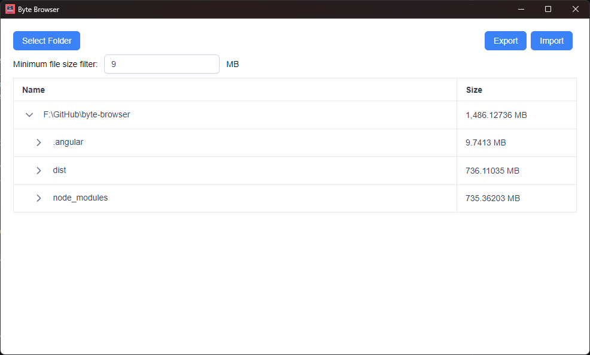

# byte-browser

Really simple folder size stats browser

## Download

[Latest version](https://github.com/supersu-man/byte-browser/releases/latest)

## Screenshot



## Node js

If you do no wish to use Byte Browser and get folder size stats run the following nodejs code:
```
const { lstatSync, readdirSync, statSync, writeFileSync } = require('fs')

getFolderStats = (thePath) => {
    console.log(thePath)
    const isDir = lstatSync(thePath).isDirectory()
    if(isDir) {
      const children = readdirSync(thePath)
      const ar = []
      var sum = 0
      for (let index = 0; index < children.length; index++) {
        const child = children[index];
        const childStats = getFolderStats(`${thePath}/${child}`)
        if(childStats) {
          childStats.data.name = child
          ar.push(childStats)
          sum += childStats.data.size
        } 
      }
      return { data: { path: thePath, size: sum }, children: ar  }
    } else {
      const size = statSync(thePath).size
      return { data: { path: thePath, name: '', size: size }  }
    }
}

const stats = getFolderStats("path/to/your/folder")

// Importable json file in Byte Browser
writeFileSync('folder_stats.json', JSON.stringify([stats]))
console.log(JSON.stringify(stats))
```

## Development

Run `npm run start` and `npm run electron-start` simultaneously to use it for development. Angular live reload works as expected. Electron code changes need rebuild.

## Build

Run `npm run electron-package` to build Angular+Electron dist uing Electron Builder.
